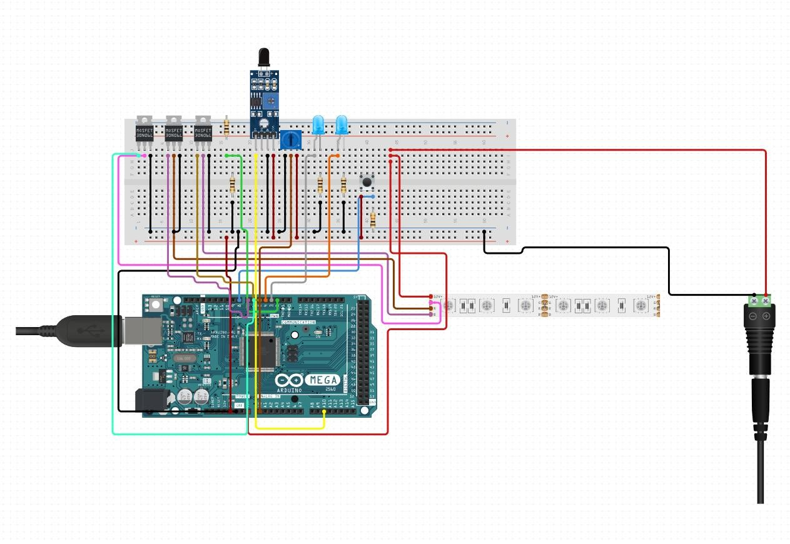

# BioPaK

## Программа для умной подсветки флорариума https://ru.wikipedia.org/wiki/%D0%A4%D0%BB%D0%BE%D1%80%D0%B0%D1%80%D0%B8%D1%83%D0%BC
Цитата из вики:
>Флора́риум, расти́тельный терра́риум — специальная закрытая ёмкость, изготовленная из стекла или других прозрачных материалов и предназначенная для содержания и разведения растений. Внутри создаются определённая влажность воздуха и температура. Часто используется для выращивания прихотливых тропических растений.

### Принцип работы подсветки:
Подсветка сделана на базе Arduino. Есть несколько режимов: 
1 Первый - не горит. 
2 Второй - с регулируемым уровнем яркости.
3 Третий  - работает только при свете дня. 
4 Четвертый - горит на максимальной яркости.
Для подсветки используется RGB лента  12 в. (управление черер мосфеты). Используется Потенциометр для изменения уровня яркости, Фото-резистер для определения дневного света и два светодиода для отображения номера режима в бинарном формате.

