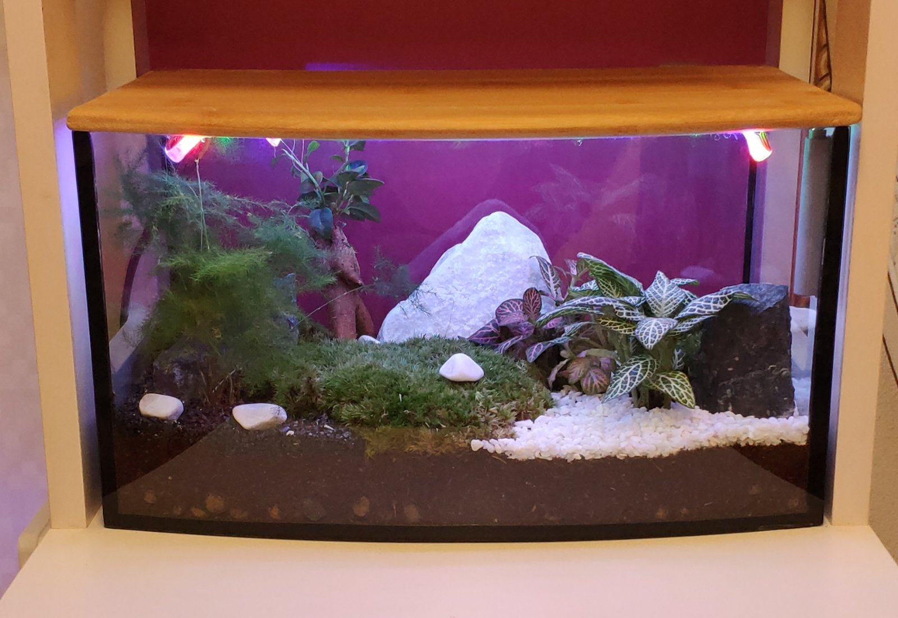

# BioPaK

## Program for smart florarium lighting https://ru.wikipedia.org/wiki/%D0%A4%D0%BB%D0%BE%D1%80%D0%B0%D1%80%D0%B8%D1%83%D0%BC
Quote from wikipedia:
>Florarium, plant terrarium - a special closed container made of glass or other transparent materials and intended for keeping and breeding plants. Inside, a certain humidity and temperature are created. Often used to grow whimsical tropical plants.

### How does the backlight work:
The backlight is based on Arduino. There are several modes:   
1st - it doesn't light.  
2nd adjustable brightness.  
3rd lights only if it's a day.   
4th maximum brightness.  
The backlight uses a 12V RGB strip. (Cherer mosfety control). Used potentiometer to change the concentration level, Photoresistor for daylight detection and two LED to display the mode number in binary format.  
The BIOPAK.ino file contains the main program.  
The RGBLed.cpp and RGBLed.h files are libraries that must be downloaded when working with the program.  
The jpg format files (florarium.jpg and schema.jpg) are designed to display the resulting scheme and florarium.

